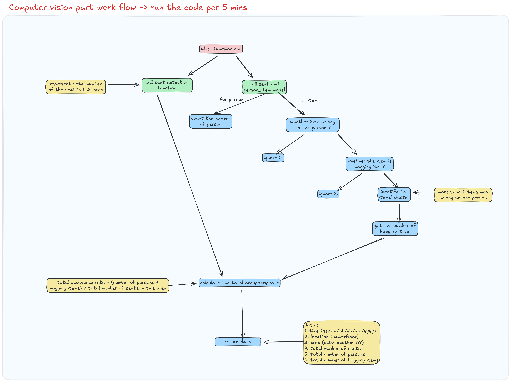

Computeer  vision part workflow: *https://excalidraw.com/#room=2023ca780dab0dde8097,0a7I4S4N0aA3U7J9d4pmIw*

Todo List: 

1. update preprocessing function (multiple method to handle different image)
2. update return data
3. update logic design
4. Train the custom models
5. Whether we really need 2 different models????

